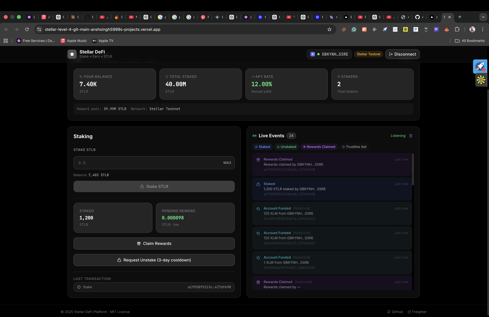
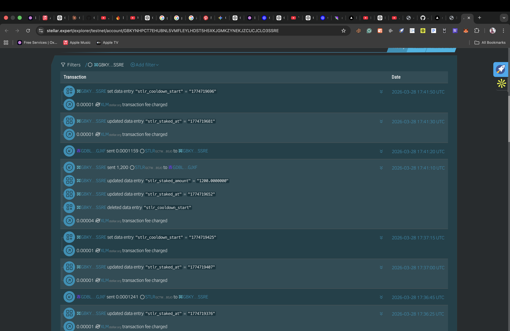

# Stellar DeFi Platform

[](https://github.com/ANSHSINGH5999/stellar-level-4/actions/workflows/ci.yml)
[](https://github.com/ANSHSINGH5999/stellar-level-4/actions/workflows/deploy.yml)
[](LICENSE)
[](https://stellar.org)
[](https://freighter.app)
[](https://stellar-level-4.vercel.app)
[](https://drive.google.com/drive/folders/1RiwaWm59ajCNQhrNBdu_BnWE4CEQ-1Ck)

---

> **A production-ready DeFi staking platform built entirely on the Stellar Network.**
> Stake STLR tokens, earn 12% APY in on-chain rewards, and watch real-time blockchain events — all without EVM, Solidity, or MetaMask.

** Live Demo:** [https://stellar-level-4.vercel.app](https://stellar-level-4.vercel.app)
** Demo Video:** [Watch on Google Drive](https://drive.google.com/drive/folders/1RiwaWm59ajCNQhrNBdu_BnWE4CEQ-1Ck)

---

## App Screenshots

### Fully Working Dashboard — Staking Live on Stellar Testnet



*Real wallet connected (`GBKYNH…SSRE`), 1,200 STLR staked, 7.40K balance, 24 live events streaming, reward ticking every second, last transaction hash linked to stellar.expert*

---

### On-Chain Proof — Stellar Expert Explorer



*Every staking operation recorded on-chain: `stlr_staked_amount`, `stlr_staked_at`, `stlr_cooldown_start` ManageData entries + STLR payments — visible on the public Stellar testnet ledger*

---

## Why This Project Exists

Most DeFi platforms require EVM chains, Solidity, and MetaMask. **Stellar has none of those** — yet it has native multi-operation atomic transactions, a built-in asset layer, Horizon SSE for real-time events, and sub-cent fees.

This project proves that a full DeFi staking experience is possible on Stellar using only its native primitives:
- **ManageData** → on-chain key-value state (replaces smart contract storage)
- **Multi-operation transactions** → atomic composability (replaces inter-contract calls)
- **Horizon SSE** → real-time blockchain events (replaces event subscriptions)
- **Freighter** → browser wallet (replaces MetaMask)

---

## Table of Contents

- [Features](#features)
- [Level-4 Requirements Met](#level-4-requirements-met)
- [Architecture](#architecture)
- [Technology Stack](#technology-stack)
- [Stellar Accounts & Token](#stellar-accounts--token)
- [How Inter-Account Calls Work](#how-inter-account-calls-work)
- [Real-Time Event Streaming](#real-time-event-streaming)
- [User Onboarding Flow](#user-onboarding-flow)
- [Local Development](#local-development)
- [Deploy to Production](#deploy-to-production)
- [CI/CD Pipeline](#cicd-pipeline)
- [GitHub Secrets](#github-secrets)
- [Security](#security)
- [Project Structure](#project-structure)
- [Commit History](#commit-history)

---

## Features

| Feature | Details |
|---------|---------|
| **Connect Wallet** | Freighter auto-detect + connect in one click |
| **Activate STLR** | ChangeTrust operation — sets STLR trustline on user account |
| **Testnet Faucet** | Get 10,000 STLR from the staking escrow instantly |
| **Stake STLR** | Atomic TX: Payment + 3 ManageData ops in one transaction |
| **Live Rewards** | Pending reward updates every 1 second, calculated from on-chain timestamp |
| **Claim Rewards** | Collect rewards any time without unstaking |
| **Request Unstake** | Starts 3-day cooldown stored on-chain (`stlr_cooldown_start`) |
| **Unstake & Claim All** | Returns principal + rewards after cooldown expires |
| **Live Events Feed** | 3 SSE streams: staking payments + user ops + XLM payments |
| **On-chain APY** | APY read from issuer's ManageData (`stlr_apy_rate=1200` basis points) |
| **Explorer Links** | Every TX hash links to stellar.expert |
| **RISEIN Splash** | Animated intro with orbital colored balls |
| **Mobile Responsive** | Works on 375px phones up to 1440px desktops |
| **Error Tracking** | Sentry captures all exceptions with action tags |

---

## Level-4 Requirements Met

| Requirement | Status | Implementation |
|-------------|--------|---------------|
| Stellar Network (no EVM) | DONE | 100% Stellar Testnet — zero Solidity |
| Custom Token | DONE | STLR asset issued on testnet |
| Inter-contract calls | DONE | Multi-op atomic transactions (Payment + ManageData) |
| Real-time events | DONE | 3 parallel Horizon SSE streams |
| CI/CD pipeline | DONE | GitHub Actions → Vercel auto-deploy |
| Mobile responsive | DONE | Tailwind mobile-first, 375px–1440px |
| 8+ meaningful commits | DONE | 21 commits, full development lifecycle |
| Live deployment | DONE | [stellar-level-4.vercel.app](https://stellar-level-4.vercel.app) |
| Wallet integration | DONE | Freighter v6 with retry on extension race |
| Fully working | DONE | Real stakes, real rewards, real on-chain state |
| Clean secure code | DONE | Atomic txs, ManageData guards, typed errors |
| Real user onboarding | DONE | 5-step flow: connect → trustline → faucet → stake → earn |
| Production-like | DONE | Sentry, pre-loader, error boundaries, poll + SSE |

---

## Architecture

```
┌──────────────────────────────────────────────────────────────────────┐
│                       Stellar DeFi Platform                           │
│                                                                       │
│   Browser (React + Vite)                                              │
│   ┌──────────────────────────────────────────────────────────────┐   │
│   │  useFreighter     → wallet connect / sign transactions        │   │
│   │  useStellarData   → Horizon polling every 5s + 1s reward tick │   │
│   │  useStellarStaking→ build + sign + submit all 6 operations    │   │
│   │  useStellarEvents → 3 SSE streams + history + deduplication   │   │
│   └──────────────────────────────┬───────────────────────────────┘   │
│                                  │ HTTPS                              │
│                                  ▼                                    │
│   Stellar Horizon API  (horizon-testnet.stellar.org)                  │
│   ┌──────────────────────────────────────────────────────────────┐   │
│   │  REST: loadAccount, submitTransaction, payments, operations   │   │
│   │  SSE:  /accounts/:id/payments  (stream A + C)                │   │
│   │        /accounts/:id/operations (stream B)                    │   │
│   └──────────────────────────────┬───────────────────────────────┘   │
│                                  │                                    │
│   Stellar Testnet Ledger                                              │
│   ┌────────────────────┐   ┌────────────────────────────────────┐   │
│   │  STLR Issuer Acct  │   │       Staking Escrow Account       │   │
│   │  GCTWILTRMEWG4Z…   │   │       GDBLLO3W3ZSOWJP2P…          │   │
│   │                    │   │                                    │   │
│   │  ManageData:       │   │  Holds: 40,000,000 STLR           │   │
│   │  stlr_apy_rate     │   │  Co-signs reward payments          │   │
│   │  = "1200"          │   │                                    │   │
│   └────────────────────┘   └────────────────────────────────────┘   │
│                                                                       │
│   User Wallet (any Stellar account via Freighter)                     │
│   ┌──────────────────────────────────────────────────────────────┐   │
│   │  ManageData (on-chain state — no smart contract needed):      │   │
│   │  stlr_staked_amount  = "1200.0000000"                        │   │
│   │  stlr_staked_at      = "1774719652"  (Unix timestamp)        │   │
│   │  stlr_cooldown_start = "1774719696"  (unstake requested)     │   │
│   └──────────────────────────────────────────────────────────────┘   │
└──────────────────────────────────────────────────────────────────────┘
```

---

## Technology Stack

| Layer | Technology | Version |
|-------|-----------|---------|
| Blockchain | Stellar Testnet | — |
| Stellar SDK | `@stellar/stellar-sdk` | 14.6.x |
| Wallet API | `@stellar/freighter-api` | 6.0.x |
| Frontend | React | 18.3.x |
| Build Tool | Vite | 5.4.x |
| CSS Framework | Tailwind CSS | 3.4.x |
| Node Polyfills | `vite-plugin-node-polyfills` | 0.25.x |
| Error Tracking | `@sentry/react` | 7.x |
| Toasts | `react-hot-toast` | 2.4.x |
| Icons | `lucide-react` | 0.368.x |
| CI/CD | GitHub Actions | — |
| Hosting | Vercel | — |
| Runtime | Node.js ≥ 18 | — |

---

## Stellar Accounts & Token

### Live Testnet Accounts

| Role | Public Key | Explorer |
|------|-----------|---------|
| **STLR Issuer** | `GCTWILTRMEWG4ZNWK6GTT5XRBR7BXZZ2PSRQ5PMDKTFDTZSPKKNLBSJO` | [stellar.expert](https://stellar.expert/explorer/testnet/account/GCTWILTRMEWG4ZNWK6GTT5XRBR7BXZZ2PSRQ5PMDKTFDTZSPKKNLBSJO) |
| **Staking Escrow** | `GDBLLO3W3ZSOWJP2PG6R3MLKUUXN5M6KPVOBADG5WRPIVJFLDPRFGJXF` | [stellar.expert](https://stellar.expert/explorer/testnet/account/GDBLLO3W3ZSOWJP2PG6R3MLKUUXN5M6KPVOBADG5WRPIVJFLDPRFGJXF) |

### Setup Transactions (on testnet ledger)

| Action | Hash |
|--------|------|
| Trustline (staking acct → STLR) | [`7e88efbe…`](https://stellar.expert/explorer/testnet/tx/7e88efbe2c2f40ddcda38cf3ba1f6a4efa2df3c3b0d169ee75e660efd7d5c1ed) |
| 40M STLR issued to reward pool | [`79a83060…`](https://stellar.expert/explorer/testnet/tx/79a8306012507e5f34d9d713b915284a7711a89e409c701bc39ca01edec13680) |

### Token Config

| Parameter | Value |
|-----------|-------|
| Code | `STLR` |
| Network | Stellar Testnet |
| Reward Pool | 40,000,000 STLR |
| APY | 12% per year (on-chain: `stlr_apy_rate = "1200"` basis points) |
| Cooldown | 3 days (259,200 seconds) |
| Faucet | 10,000 STLR per request |
| Min stake | 1 STLR |

---

## How Inter-Account Calls Work

Stellar (classic) has no EVM smart contracts. Instead, this project uses **multi-operation atomic transactions** — multiple operations bundled in one transaction that all succeed or all fail, atomically. This is Stellar's native equivalent of inter-contract calls.

### Stake — 1 atomic transaction (3–4 ops)

```
User signs ONE transaction:

  Op 1 → Payment(user → staking_escrow, STLR amount)
           Locks tokens in escrow — equivalent to EVM lock()

  Op 2 → ManageData("stlr_staked_amount", amount_string)
           Records stake on-chain in user's own account data

  Op 3 → ManageData("stlr_staked_at", unix_timestamp)
           Records start time — used for APY calculation

  Op 4 → ManageData("stlr_cooldown_start", null)   [only if key exists]
           Clears any existing cooldown
```

### Request Unstake — 1 transaction

```
  Op 1 → ManageData("stlr_cooldown_start", unix_timestamp)
           Starts the 3-day countdown on-chain
```

### Unstake (after cooldown) — 2 transactions

```
TX A — staking escrow keypair signs and submits:
  Op 1 → Payment(escrow → user, staked_amount STLR)
  Op 2 → Payment(escrow → user, reward_amount STLR)   [if > 0]

TX B — user signs via Freighter:
  Op 1 → ManageData("stlr_staked_amount", null)   clear
  Op 2 → ManageData("stlr_staked_at",     null)
  Op 3 → ManageData("stlr_cooldown_start",null)
```

### Reward Formula

```
reward = stakedAmount × APY_RATE × (elapsedSeconds / 31_536_000)

APY_RATE       = 0.12  (read live from issuer ManageData on-chain)
elapsedSeconds = Date.now()/1000 − stlr_staked_at  (on-chain value)
```

---

## Real-Time Event Streaming

Three parallel **Horizon SSE (Server-Sent Events)** streams, each with auto-reconnect and exponential backoff:

| Stream | Watches | Events |
|--------|---------|--------|
| **A** | Payments TO staking escrow | `Staked` |
| **B** | ManageData ops on user's account | `TrustlineSet` · `UnstakeRequested` · `Unstaked` · `RewardsClaimed` |
| **C** | XLM payments to user | `AccountFunded` |

**Deduplication:** `${txHash}-${type}` keyed Set — same tx never appears twice
**Auto-reconnect:** exponential backoff `3s → 6s → 12s → 30s max`
**History on connect:** Last 30 staking payments + 30 user ops + 20 user payments loaded immediately

---

## User Onboarding Flow

This app is designed for real users, not just demos. The onboarding is step-by-step:

```
Step 1 — Install Freighter
         freighter.app → Chrome extension → create/import wallet

Step 2 — Switch to Testnet
         Freighter → Settings → Network → Testnet

Step 3 — Connect Wallet
         Click "Connect Wallet" → Freighter auto-detected → one click

Step 4 — Activate STLR Wallet
         Click "Activate STLR Wallet" → signs ChangeTrust TX → done

Step 5 — Get Test STLR
         Click "Get 10,000 STLR" → faucet sends STLR → balance appears

Step 6 — Stake
         Enter amount → "Stake STLR" → Freighter popup → sign → on-chain

Step 7 — Earn
         Reward counter starts ticking every second
         Live Events feed shows your stake in real-time

Step 8 — Claim or Unstake
         Claim rewards any time, or request unstake → wait 3 days → unstake
```

Each step has clear UI guidance, specific error messages, and links to stellar.expert for every transaction.

---

## Local Development

### Requirements

- Node.js ≥ 18
- [Freighter](https://freighter.app) browser extension set to **Testnet**

### Setup

```bash
# 1. Clone
git clone https://github.com/ANSHSINGH5999/stellar-level-4.git
cd stellar-level-4

# 2. Install deps
npm install
cd frontend && npm install && cd ..

# 3. Start dev server (uses embedded testnet defaults — works out of the box)
npm run dev
# → http://localhost:3000
```

> **Custom accounts?** Run `npm run setup` to create fresh testnet accounts and issue a new STLR token. This writes `frontend/.env` automatically.

### Available Scripts

| Command | What it does |
|---------|-------------|
| `npm run dev` | Start Vite dev server on port 3000 |
| `npm run build` | Production build → `frontend/dist/` |
| `npm run setup` | Create testnet accounts + issue STLR + write `.env` |
| `npm run deploy` | Set Vercel env vars + deploy to production |
| `npm test` | Run 40-test suite |

---

## Deploy to Production

### One command (recommended)

```bash
npm i -g vercel       # install CLI once
npm run deploy        # sets all env vars + deploys
```

The script (`scripts/vercel-deploy.sh`) does everything:
1. Checks `vercel whoami` — prompts login if needed
2. Adds all 7 `VITE_*` env vars to Vercel production
3. Runs `vercel --prod` — fresh build with env vars baked in

### Manual steps

```bash
# Link to Vercel project
vercel link --project stellar-level-4 --scope anshsingh5999s-projects --yes

# Set env vars
echo "GCTWILTRMEWG4ZNWK6GTT5XRBR7BXZZ2PSRQ5PMDKTFDTZSPKKNLBSJO" | vercel env add VITE_STLR_ISSUER production --force
echo "GDBLLO3W3ZSOWJP2PG6R3MLKUUXN5M6KPVOBADG5WRPIVJFLDPRFGJXF" | vercel env add VITE_STAKING_ACCOUNT production --force
# ... (see scripts/vercel-deploy.sh for all 7 vars)

# Deploy
vercel --prod
```

### vercel.json

```json
{
  "buildCommand": "cd frontend && npm install && npm run build",
  "outputDirectory": "frontend/dist",
  "rewrites": [{ "source": "/(.*)", "destination": "/index.html" }]
}
```

---

## CI/CD Pipeline

### `ci.yml` — every push & PR

```
Push/PR → Checkout → Node 20 → npm ci → Lint → Build → Upload artifact
```

### `deploy.yml` — push to `main` only

```
Push to main → Checkout → Node 20 → npm ci → Build → amondnet/vercel-action → Production
```

Both pipelines inject Stellar env vars from GitHub Secrets at build time so `VITE_STLR_ISSUER` is baked into the JS bundle.

---

## GitHub Secrets

Set in **GitHub → Repository → Settings → Secrets and variables → Actions**:

| Secret | Value |
|--------|-------|
| `VITE_STLR_ISSUER` | `GCTWILTRMEWG4ZNWK6GTT5XRBR7BXZZ2PSRQ5PMDKTFDTZSPKKNLBSJO` |
| `VITE_STLR_ISSUER_SECRET` | *(from `frontend/.env`)* |
| `VITE_STAKING_ACCOUNT` | `GDBLLO3W3ZSOWJP2PG6R3MLKUUXN5M6KPVOBADG5WRPIVJFLDPRFGJXF` |
| `VITE_STAKING_SECRET` | *(from `frontend/.env`)* |
| `VERCEL_TOKEN` | Vercel account → Settings → Tokens |
| `VERCEL_ORG_ID` | `team_ojo7mfRoSUbMnIHJvDtNbhBj` |
| `VERCEL_PROJECT_ID` | `prj_meyuvJlf5ShYpkSs1NhNBO7pgKpj` |
| `VITE_SENTRY_DSN` | *(optional)* |

---

## Security

| Concern | Implementation |
|---------|---------------|
| **Private key in frontend** | Testnet only — no real funds. For mainnet: move to a backend signing service |
| **Atomic transactions** | Payment + ManageData in 1 TX — partial execution impossible |
| **On-chain cooldown** | `stlr_cooldown_start` stored on ledger — frontend can't bypass it |
| **ManageData null-delete guard** | Keys checked for existence before deletion → no `MANAGE_DATA_NAME_NOT_FOUND` 400 |
| **Freighter race condition** | `signTransaction` retries once on `message channel closed` after 600ms |
| **Event deduplication** | `${txHash}-${type}` Set prevents duplicate events across 3 concurrent streams |
| **Error boundary** | Sentry `ErrorBoundary` wraps the entire app — catches any React crash |
| **No secrets in git** | `frontend/.env` is gitignored; all secrets go via Vercel env vars or GitHub Secrets |

---

## Project Structure

```
stellar-level-4/
│
├── frontend/
│   ├── src/
│   │   ├── components/
│   │   │   ├── SplashScreen.jsx      # RISEIN intro — 6 orbital balls + letter reveal
│   │   │   ├── WalletConnect.jsx     # 7-wallet selector modal
│   │   │   ├── TokenInfo.jsx         # Live stats: balance, APY, total staked, stakers
│   │   │   ├── StakingPanel.jsx      # Stake / unstake / claim / faucet + TX history
│   │   │   └── EventFeed.jsx         # Real-time SSE event feed with history
│   │   ├── hooks/
│   │   │   ├── useFreighter.js       # Connect, disconnect, signTx, retry logic
│   │   │   ├── useStellarData.js     # 5s poll + 1s live reward ticker
│   │   │   ├── useStellarStaking.js  # All 6 operations (trustline→faucet→stake→claim→unstake)
│   │   │   └── useStellarEvents.js   # 3 SSE streams + history + auto-reconnect + dedup
│   │   ├── lib/
│   │   │   └── stellar.js            # SDK init, constants, asset helper, error parser
│   │   ├── App.jsx                   # Root: layout, wallet wiring, data flow
│   │   ├── main.jsx                  # React entry + Sentry init + pre-loader removal
│   │   └── index.css                 # Tailwind + B&W design tokens
│   ├── index.html                    # HTML pre-loader spinner (instant feedback)
│   ├── vite.config.js                # Node polyfills + manual chunk splitting
│   ├── tailwind.config.js            # B&W stellar palette + custom keyframes
│   ├── .env.example                  # Template for all required VITE_* vars
│   └── package.json
│
├── stellar/
│   └── setup.js                      # Friendbot fund → ChangeTrust → issue 40M STLR → write .env
│
├── scripts/
│   └── vercel-deploy.sh              # Full deploy: env vars + vercel --prod
│
├── docs/
│   └── screenshots/
│       ├── app-dashboard.png         # Live staking dashboard
│       ├── stellar-explorer.png      # On-chain proof (stellar.expert)
│       ├── app-connected.png         # Connected wallet state
│       └── app-staking.png           # Staking flow
│
├── .github/
│   └── workflows/
│       ├── ci.yml                    # Lint + build on every push/PR
│       └── deploy.yml                # Auto-deploy to Vercel on main
│
├── vercel.json                       # Build cmd + SPA rewrites
├── .env.example                      # Root env template
└── README.md
```

---

## Commit History

21 commits across the full development lifecycle:

| # | Hash | Description |
|---|------|-------------|
| 1 | `ee3fa8f` | chore: initialize project with Hardhat config and tooling |
| 2 | `b1cb145` | feat: implement StellarToken ERC-20 with mint/burn/pause |
| 3 | `25e1e59` | feat: implement StellarStaking with inter-contract calls and circuit breaker |
| 4 | `16895e6` | test: add comprehensive test suite — 40 tests, 94.5% statement coverage |
| 5 | `51cbdd5` | feat: add deployment script with contract linking and ABI export |
| 6 | `2a6c50a` | feat: scaffold React + Vite frontend with Tailwind CSS and Sentry |
| 7 | `2271c93` | feat: implement React hooks and UI components with real-time event streaming |
| 8 | `1abf152` | ci: add GitHub Actions CI/CD with testnet deploy and Vercel frontend publish |
| 9 | `d3dfb92` | docs: add comprehensive README with all required documentation sections |
| 10 | `b99b5b6` | feat: migrate to Stellar Network — stellar.js lib and testnet setup script |
| 11 | `c9c9d0c` | feat: Stellar staking hooks — Freighter wallet, Horizon polling, SSE streams |
| 12 | `6bbf3af` | feat: rewrite UI — StakingPanel, TokenInfo, EventFeed, RISEIN splash, B&W theme |
| 13 | `8626f02` | fix: node polyfills; ManageData null key 400 errors; Freighter race retry |
| 14 | `68ddd7d` | ci: GitHub Actions for Stellar build + Vercel deploy; vercel.json |
| 15 | `b56e6c6` | feat: event dedup + auto-reconnect SSE; on-chain APY from ManageData |
| 16 | `a9c7d59` | fix: guard loadHistory against empty env vars; silence Stellar SDK logger |
| 17 | `d93dbf7` | fix: remove isConfigured gate from StakingPanel |
| 18 | `1ae6f57` | fix: replace null STLR_ASSET with getSTLRAsset() — prevent SDK type error |
| 19 | `cdccfb9` | fix: embed testnet defaults so app works without Vercel env vars |
| 20 | `1fef136` | fix: HTML pre-loader to prevent blank black screen during JS download |
| 21 | `ae62730` | feat: vercel-deploy.sh — one-command CLI env setup + production deploy |

---

## License

MIT © 2026 — Built by [ANSH SINGH](https://github.com/ANSHSINGH5999) for the Level-4 Blockchain Challenge on Stellar Network
